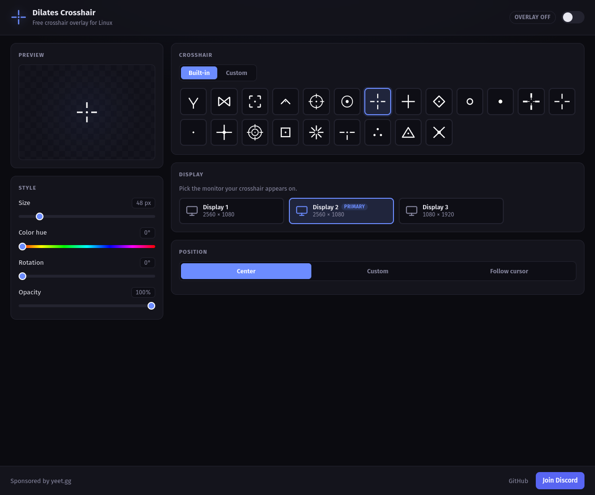

<div align="center">


# Dilates Crosshair

**A free, open-source crosshair overlay for Linux gaming — the Crosshair X alternative.**

[](LICENSE)
[](#requirements)
[](https://www.electronjs.org/)

*Sponsored by [yeet.gg](https://yeet.gg)*



</div>

---

## Why Dilates Crosshair?

Crosshair X is great — but it's paid and Windows-only. Dilates Crosshair gives Linux gamers the same thing for free: a clean, always-on-top crosshair overlay that works in any game, with zero game-file modification and zero cost.

- 🎯 **22 built-in crosshairs** — dots, crosses, circles, chevrons, scopes, brackets, and more
- 🖼️ **Custom crosshairs** — point it at any folder of PNG/SVG images and use your own
- 🖥️ **Multi-monitor aware** — automatically detects all your displays; pick which screen the crosshair appears on with one click, perfectly centered
- 🎨 **Full styling** — size, color hue, rotation, and opacity sliders with a live preview
- 📍 **Flexible positioning** — screen center, exact pixel offset, or follow your cursor
- ⌨️ **Hotkey placement** — press `Ctrl+Shift+P` to snap the crosshair to your mouse position
- 💾 **Remembers your setup** — settings persist between launches
- 🖱️ **Click-through overlay** — never blocks your mouse, never steals focus

## Requirements

- Linux (X11, or Wayland via XWayland)
- Node.js 18+ and npm (for installing from source)

> **Compositor support:** works out of the box on GNOME, KDE, and Hyprland. On Hyprland the app automatically registers a window rule for the overlay (no blur, no shadow, no border, no rounding) so the crosshair renders clean — both the new Lua config (0.55+) and older conf-based versions are handled. On other tiling compositors you may need a similar rule to keep the overlay floating and undecorated.

## Installation

### Quick install (recommended)

```bash
git clone https://github.com/dilates/crosshair.git
cd crosshair
./install.sh
```

That's it — the installer builds the app, adds a **Dilates Crosshair** entry to your app menu, and puts a `dilates-crosshair` command on your PATH.

Prefer a portable single file? Build and install an AppImage instead:

```bash
./install.sh --appimage
```

To remove everything:

```bash
./uninstall.sh
```

### Run from source (no install)

```bash
npm install
npm start
```

### Build packages yourself

```bash
npm run appimage   # → dist/Dilates Crosshair-<version>.AppImage
npm run flatpak    # → flatpak bundle
```

A Flathub-style manifest is included as `gg.yeet.DilatesCrosshair.yml` — see the comments inside it for `flatpak-builder` instructions.

## Usage

1. **Launch** the app and click **Launch** on the splash screen.
2. **Pick a crosshair** from the Built-in gallery, or switch to the Custom tab and choose a folder of your own PNG/SVG images.
3. **Style it** — adjust size, hue, rotation, and opacity. The preview updates live.
4. **Choose your display** — every connected monitor is detected automatically. Click the one you game on; the crosshair centers on it.
5. **Fine-tune position** (optional):
   - **Center** — dead center of the selected display (the default; right where it should be)
   - **Custom** — exact X/Y pixel offset within the selected display, or press `Ctrl+Shift+P` with your mouse anywhere on screen to snap it there
   - **Follow cursor** — the crosshair rides your mouse
6. **Flip the Overlay switch** in the top-right corner. Game on. 🎮

The overlay is click-through and stays on top of fullscreen games. All your settings are saved automatically and restored next launch.

| Shortcut | Action |
|---|---|
| `Ctrl+Shift+P` | Snap crosshair position to current mouse location (global) |

## Adding your own crosshairs

Drop PNG or SVG files into any folder, then in the app: **Crosshair → Custom → Choose folder…**. Square images with transparent backgrounds work best. White/light crosshairs recolor cleanly with the hue slider.

Want to contribute a design to the built-in set? PRs welcome — add a 32×32 viewBox SVG to `public/crosshairs/`.

## Project structure

```
├── src/                 # Electron main process + preload scripts (TypeScript)
├── public/              # UI (HTML/CSS/JS), overlay, splash, crosshair SVGs
│   └── crosshairs/      # Built-in crosshair pack
├── assets/              # App icon for packaging
├── install.sh           # One-step installer
└── uninstall.sh         # Clean removal
```

## Contributing

Issues and pull requests are welcome at [github.com/dilates/crosshair](https://github.com/dilates/crosshair). Crosshair designs, Wayland improvements, and packaging help are especially appreciated.

## Support the project

Dilates Crosshair is free forever. It's sponsored by [yeet.gg](https://yeet.gg) — crypto swaps with low fees and no KYC. Using it supports development. You can also hang out with us on [Discord](https://discord.gg/cheese).

## License

[MIT](LICENSE) © [dilates](https://github.com/dilates)
